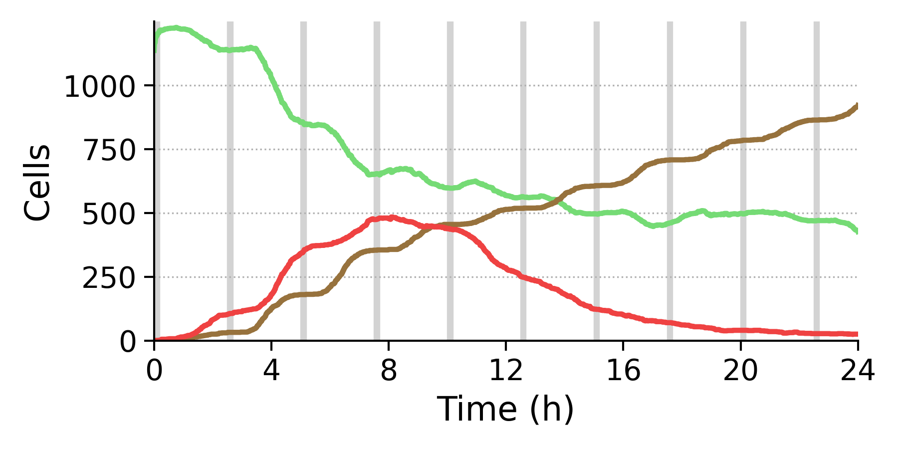
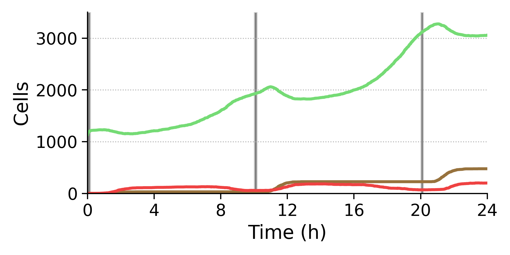

forked from [migp11/PhysiBoSSv2-EMEWS](https://github.com/migp11/PhysiBoSSv2-EMEWS)

***For results, please checkout to the 'coin_paper_results' branch***

Overview
-----------------------
This repository combines various libaries and components to deliver a parallelized simulator for tumor cell growth that can be used for exploring parameter values of interest, for example related to cell growth, or to the effectiveness of drug treatments.

An [EMEWS](https://emews.github.io) template is utilized, which is a workflow that incorporates [Swift-T](http://swift-lang.org/Swift-T/) and enables the combination and parallel execution of model exploration algorithms written in different languages.
Combined therein are:
* [PhysiBoSSv2](https://github.com/bsc-life/PhysiBoSSv2) with the spheroid-TNF-v2 model integrated as a custom module
* a Genetic Algorithm implementation based on the [DEAP](https://deap.readthedocs.io/en/master/) Python framework
* an Active Learning approach with Random Forests for parameter space characterization (as in [Ozik et al., 2019](https://pubs.rsc.org/en/content/articlepdf/2019/me/c9me00036d))
* scripts for simulation results summarization

### spheroid-TNF-v2
The spheroid-TNF-v2 is an implementation of a multi-scale agent-based model that simulates the growth of tumor spheroids. The model can take into account the effects of a signaling molecule that binds to cell receptors and may trigger a wide range of difference responses.
Specifically, this workflow uses PhysiCell to provide the cell agents with an intracellular signal transduction model utilizing the PhysiBoSS extension. This signalling model is used to compute cell responses to perturbations such as the presence of signalling molecules and drugs.

Usage:
-----------------------
This repository can be used to:
* Calibrate biophysical parameters of the given model based on some reference cases (golden standards)
* Find optimal treatments for reducing tumor cell population

##### Calibration
-Examines the differences in results between current simulator configurations and some 'Golden Standard' cases.
Here, we have the following two.

Cell counts in the two Golden Standard cases (Green: Alive, Red: Apoptotic, Brown: Necrotic):

TNF frequency 150:

TNF frequency 600:

The parallel search is performed with the use of a Genetic Algorithm that has configurable objective functions as replaceable components.

-For calibrating the biophysical parameters, various distance metrics are utilized to measure the difference between the simulation output produced using the various candidate solutions, and the output of two ground truth simulations, which have predefined settings related to drug treatments and are produced by previous simulator versions.
In particular, the distance types that can be used are the following:

* Euclidean distance
* Dynamic Time Warping
* l1 distance

and the parameters that are being explored are: TNFR Binding rate, TNFR Endocytosis rate, TNFR Recycling rate.

##### Effective treatment discovery using GA
-For the evaluation of drug treatment configurations a different objective function is used, which counts the number of alive tumor cells at the end of the simulation, when applying treatments with the following configurable parameters: TNF Administration frequency, TNF Administration duration, TNF Concentration.

##### Active Learning and model exploration
-The approach presented in [Ozik et al., 2019](https://pubs.rsc.org/en/content/articlepdf/2019/me/c9me00036d), where Random Forests are used to classify the parameter space into interesting and not interesting regions.

### Installation and Execution
Clone the repository:

`$ git clone https://github.com/xarakas/spheroid-tnf-v2-emews.git`

Compile [PhysiBoSSv2]:

`$ cd data/PhysiBoSSv2`

`$ make`

`$ cd ../..`

##### GA_CONFIG file (in JSON format)

{

    "distance_type" : "l1",         // Can either be 'euclidean', 'dtw', or 'l1'
    "termination_crit" : "fitmin",  // Can either be 'genmax', 'fitmin', 'fitavg', or 'fitvar'
    "termination_args" : 2.55,      // Either integer or float, according to the "termination_crit" value (cf. below)
    "pop_num" : 40,                 // Population number
    "crossover_prob": 0.75,         // Crossover probability
    "mutation_prob": 0.5,           // Mutation probability
    "tournament_size": 3            // Tournament selection - tournament size

}

``termination_crit``:

genmax: Stop when a number of generations is met (the provided integer in the ``termination_args`` field).

fitmin: Stop when an individual with lower fitness than the ``termination_args`` value is discovered.

fitavg: Stop when the average fitness score of the population drops below ``termination_args`` value.

fitvar: Stop when the variance of the fitness scores of the population is below ``termination_args`` value for five consecutive generations.

##### Run a calibration experiment
The params file must be described in .json format, see examples in `data/`:

`$ bash swift/swift_run_eqpy_compare.sh <EXPERIMENT_ID> <GA_PARAMS_FILE> <GA_CONFIG> <CHECKPOINT_FILE>`
(e.g. bash swift/swift_run_eqpy_compare.sh experiment_1 data/ga_params.json data/ga_config.json last_experiment.pkl)

<CHECKPOINT_FILE> is optional, and contains the GA state from a previous run (stored automatically inside the experiment folder `experiments/`.
Logs regarding time, individuals examined and their fitness scores can be found in `experiments/<EXPERIMENT_ID>/generations.log`.

##### Perform parameter sweep
Again, a params file should be given, see e.g. `data/inputs.txt`:

`$ bash swift/swift_run_sweep.sh <EXPERIMENT_ID> <SWEEP_INPUT>`
(e.g. bash swift/swift_run_sweep.sh experiment_1 data/input.txt)

##### Discover effective drug treatments

###### Genetic Algorithm
`$ bash swift/swift_run_eqpy.sh <EXPERIMENT_ID> <GA_PARAMS_FILE> <GA_CONFIG> <CHECKPOINT_FILE>`
(e.g. bash swift/swift_run_eqpy.sh experiment_1 data/ga_params.json data/ga_config.json last_experiment.pkl)

<CHECKPOINT_FILE> is optional, and contains the GA state from a previous run (stored automatically inside the experiment folder `experiments/`.
Logs regarding time, individuals examined and their fitness scores can be found in `experiments/<EXPERIMENT_ID>/generations.log`.

###### Simulated Annealing
`$ bash swift/swift_run_eqpy_sa.sh <EXPERIMENT_ID> <SA_PARAMS_FILE> <SA_CONFIG>`
(e.g. bash swift/swift_run_eqpy_sa.sh experiment_1 data/ga_params.json data/sa_config.json)

The parameters of the simulated annealing method are set in the `SA_CONFIG` file, as follows:

{

    "temperature" : 100,                // Initial temperature
    "min_temperature" : 15,             // Minimum temperature
    "cooling" : 0.8,                    // Cooling factor
    "max_iterations" : 10,              // Iterations per temperature level
    "distance_threshold" : 0.02,        // Distance threshold of neighbourhood
    "seeded_pop": "YES"                 // 'YES' if initial point is given from txt file

}

If seeded_pop is set to "YES", a txt file containing the initial point must be provided in the `python` folder.
##### Active learning scenario
`$ bash swift/swift_run_eqpy_rand.sh <EXPERIMENT_ID> <RAND_PARAMS_FILE> <RAND_CONFIG>`
(e.g. bash swift/swift_run_eqpy_rand.sh experiment_1 data/ga_params.json data/rand_config.json)
Logs regarding the experiment conducted can be found in `experiments/<EXPERIMENT_ID>/iterations.log`.

Scripts regarding the analysis of the experiments and the graphical representation of the various parts of the experiments can be found in the folder `experimental_analysis`.

The parameters of the active learning algorithm are set in the `RAND_CONFIG` file, as follows:

{

    "method" : "BIRCH", // Can either be 'BIRCH', 'DBSCAN', or 'KMEANS'
    "param1" : 100,     // KMEANS->k, DBSCAN->eps, BIRCH->branching factor
    "param2" : 0.1      // KMEANS->None, DBSCAN->MinPts, BIRCH->threshold

}

The random seed of the experiment conducted and the number of the initial population is set in the `swift/swift_run_eqpy_rand.sh` file.

Results from past experiments are used in order to reduce the runtime of the active learning scenario. These results can be found at `all_exps_DD.csv` csv file in the `python` folder.

### Important note:
.sh files in the `swift/` folder  set various environment parameters for the execution.
Make sure that:
* PROCS is set to a number higher than 3.
* MACHINE is set to blank ("") if not having `slurm` installed (e.g. when executing locally and not on HPC)

This project is compatible with swift-t v. 1.3+. Earlier
versions will NOT work.

### Further reading:
For more information regarding installation and execution, please see the file how-to-launch.txt
